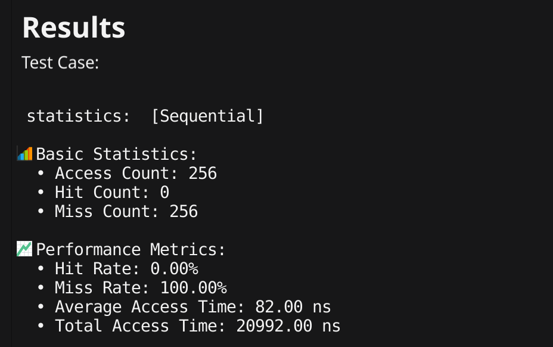

# Cache Simulator

A cache simulator implemented in Go with Fyne GUI framework, designed to demonstrate and analyze cache access patterns.

## Features

- 4-way set-associative cache structure
- 8 sets with 4 blocks per set
- LRU (Least Recently Used) replacement policy
- Real-time visualization of cache access process
- Multiple test sequence patterns
- Detailed performance statistics

## Test Modes

1. **Sequential Test**

   - Access memory addresses in sequence
   - Tests basic cache functionality

2. **Random Test**

   - Generates random access sequences
   - Simulates real program random access patterns

3. **Mid-Repeat Test**

   - Repeats access in the middle portion of the sequence
   - Tests cache locality principle

## Cache Parameters

- Cache Access Time: 1ns
- Main Memory Access Time: 10ns
- Memory Access Penalty: 162ns (1 + 16\*10 + 1)
- Number of Sets: 8
- Ways per Set: 4
- Customizable Parameters

  ```go
  func NewCache(way, blockNumber, lineSize int) *Cache {

  	var (
  		SetNum = blockNumber / way
  		cache  = &Cache{
  			config: CacheConfig{
  				WayNum:      way,
  				SetNum:      SetNum,
  				LineSize:    lineSize,
  				BlockNumber: blockNumber,
  			},
  			Sets: make([]Set, SetNum),
  		}
  	)

  	for i := range cache.Sets {
  		cache.Sets[i] = Set{
  			Blocks: make([]Block, way),
  		}
  	}

  	return cache
  }
  ```

## Performance Metrics

- Access Count
- Hit Count
- Miss Count
- Hit Rate
- Miss Rate
- Average Access Time
- Total Access Time

```
h is the hit rate
C is cache access time
M is the miss penalty

T(avg) = Hit Count _ C + (1-h) _ miss penalty

```

# Interface Guide


1. **Parameter Settings**

   - Configure number of cache blocks

     

2. **Test Options**

   - Select different test modes
   - Start simulation

   

3. **Visualization Area for tracing**

   - Real-time access sequence display
   - Hit/Miss status indication
   - SET index display
   - Progress bar for test completion
   - snapshot of cache access process

   

4. **Results Area**

   - Detailed performance statistics
   - Basic stats and performance metrics

   

## Development Environment

- Go 1.21.3
- Fyne v2.x

## Cache Structure

```go
type Block struct {
	SeqNumber int  // seqNumber
	Age       int  // age
	Valid     bool // valid bit for LRU
}

type Set struct {
	Blocks []Block
}

type CacheConfig struct {
	BlockNumber int // total block number in cache
	WayNum      int // N-way set associative
	SetNum      int // set number
	LineSize    int // word size per block
}

// cache ,4way = 4block/per
type Cache struct {
	config      CacheConfig
	Sets        []Set
	AccessCount int
	HitCount    int
	MissCount   int
}

```

# Performance Analysis

1. **Sequential**

```
Sequential sequence: up to 2n cache block. Repeat the sequence four times. Example: 0,1,2,3,...,63 {4x}
```

- results
  
- analysis
  - Zero hit rate is expected for sequential access
  - Each memory block is accessed exactly once
  - Each access maps to a different set, preventing locality benefits
  - Highest average access time due to constant memory access
  - Total access time is maximized due to 100% miss rate

2. **Random sequence**

```
Random sequence: containing 4n main memory blocks.
```

- results
  
- analysis
  - Moderate hit rate due to random access patterns
  - Some hits occur due to random repeated accesses
  - Better performance than sequential access
  - Average access time reduced by ~27.67ns compared to sequential
  - Demonstrates that even random access can benefit from caching

3. **Mid-repeat blocks**

```
Start at block 0, repeat the sequence in the middle two times up to n-1 blocks, after
which continue up to 2n. Then, repeat the sequence four times. Example: if n=8, sequence=0, 1,2,3,4,5,6,7
1,2,3,4,5,6,7 8,9,10,11,12,13,14,15 {4x}
```

- results
  
- analysis
  - Highest hit rate among all tests
  - Effectively demonstrates temporal locality
  - Lowest average access time
  - Middle portion reuse significantly improves cache performance
  - Shows the benefit of data reuse in cache systems

## Overall Conclusion

1. Cache effectiveness is highest with repeated access patterns
2. Sequential access pattern is the worst case for cache performance
3. Random access provides some cache benefits but is not optimal
4. Results validate the importance of temporal locality in cache design
5. The 4-way set-associative design shows good performance for repeated access patterns
   These results align with theoretical cache behavior and demonstrate the fundamental principles of cache memory systems.

## Build and Run

### Prerequisites

- Go 1.21.3
- macOS or Linux/Windows
- Fyne v2.x

```bash

go install fyne.io/fyne/v2/cmd/fyne@latest

go mod tidy
go run .

```

## to build

- macOS

  ```bash
  fyne package -os darwin -icon docs/logo.png
  ```

- Linux

  ```bash
  fyne package -os linux -icon docs/logo.png

  ```

- Windows
  ```bash
  fyne package -os windows -icon docs/logo.png
  ```

### executable file included

- macOS
  ```bash
  /execute/cache_simulator_mac
  ```
- Linux

  ```bash
  /execute/cache_simulator_unix
  ```

- Windows
  ```bash
  /execute/cache_simulator_win.exe
  ```

# Demo Video


